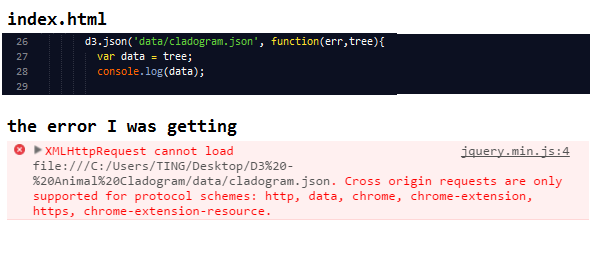

##Animal Kingdom Cladogram##

Just wanted to play around with D3's tree layout functionality. 

#####Other Things I Learned:#####
* You'll get a Cross-origin error if you try to load an html file that is pulling json from another file. The way you can bypass the error is through creating a node server and serving the json files. 

* How to play with D3 code on [tributary.io](http://tributary.io/inlet/0429b94a2e3ebccb5c30) and then migrate it to local files
* How to use constructor functions to quickly create Tree classes with properties 'name' and 'children'. I then used the constructor function to quickly generate my data structure that I used for my JSON file. 

#####Screenshot of the D3 Tree Layout#####

#####How to run on your pc:#####
* clone the repo 
* run npm install
* run node server.js
* open localhost:3000 on your browser